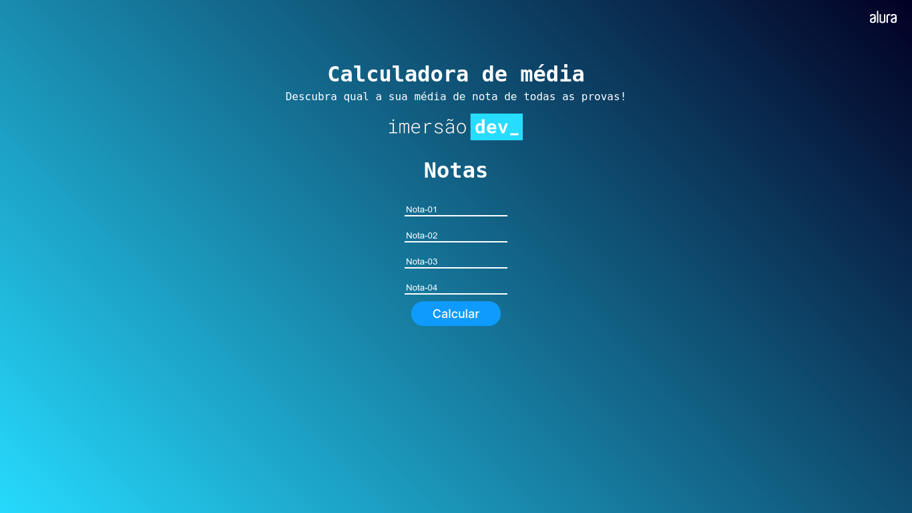
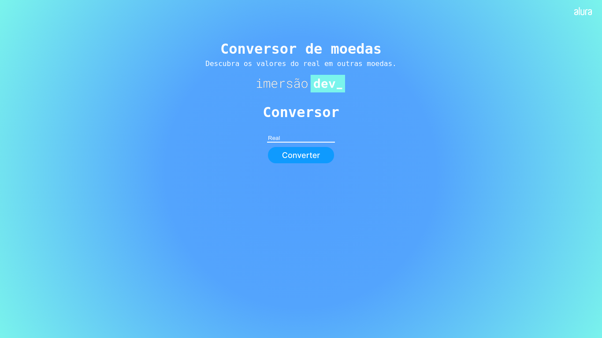
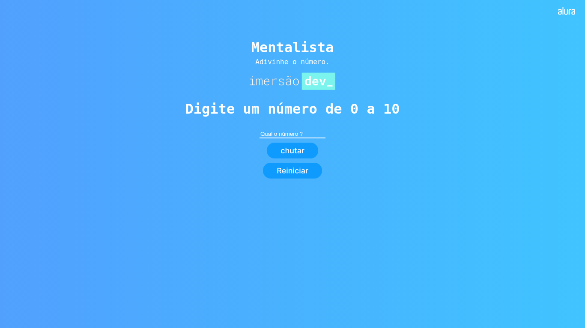

# ImersãoDev-2022

ImersãoDev da alura realizada nos dias 07 a 18 de março de 2022 este é o meu repositorio com os projetos realizados

## Projetos
<h1 align="center">Aula-01 - Calculadora de media :heavy_check_mark:</h1>  

[Link do resultado](https://vitor-imersaodev-media.netlify.app/)  
[Link do repositorio](https://github.com/vitorFRE/ImersaoDev-alura/tree/main/Calculadora-Media)  

Nesta primeira aula da Imersão Dev, vamos criar uma calculadora de média e aprender o que são variáveis e como realizar operações!

  

<h1 align="center">Aula-02 - Conversor de moedas :heavy_check_mark:</h1>  

[Link do resultado](https://vitor-imersaodev-conversor.netlify.app/)  
[Link do repositorio](https://github.com/vitorFRE/ImersaoDev-alura/tree/main/CONVERSOR-DE-MOEDAS)  

Segunda aula da Imersão Dev, criar um conversor de moedas, onde você conseguirá transformar em reais um produto que estiver com o preço em dólares!

  

<h1 align="center">Aula-03 - Mentalista :heavy_check_mark:</h1>  

[Link do resultado](https://vitor-imersaodev-mentalista.netlify.app/)  
[Link do repositorio](https://github.com/vitorFRE/ImersaoDev-alura/tree/main/MENTALISTA)  

Segunda aula da Imersão Dev, criar um conversor de moedas, onde você conseguirá transformar em reais um produto que estiver com o preço em dólares!

  

